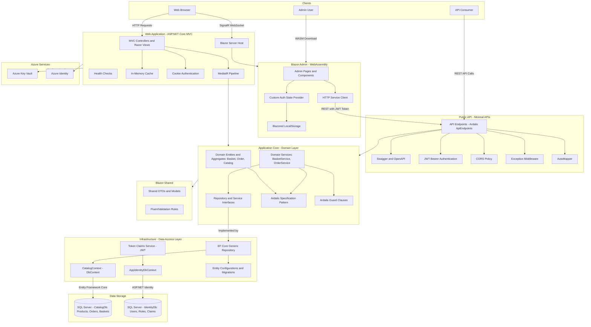

# Architecture Diagram

eShopOnWeb is a multi-tier e-commerce application built with Clean Architecture principles, featuring an ASP.NET Core MVC storefront, a Blazor WebAssembly admin portal, and a RESTful API layer, all backed by SQL Server via Entity Framework Core.

## Application Architecture

